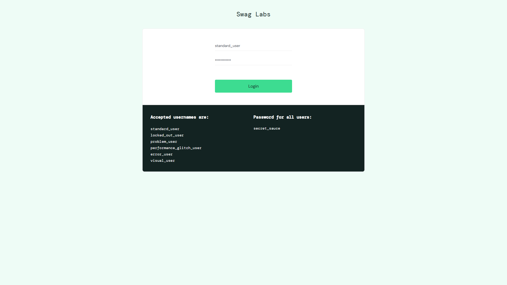

# Reporte final

## Resultado de ejecución

| Suite | Comando | Resultado |
|-------|---------|-----------|
| Regresión E2E (TC-01, TC-02, TC-03) x Chrome y Edge | `npm test` | 6 passed |
| Verificación completa | `npm run verify` (typecheck + lint + test) | OK |
| Fallo intencional (diagnóstico) | `npm run test:fail` | 2 failed (esperado: 1 por navegador) |
| Banco de pruebas del healer | `npm run test:healing` | 1 failed (esperado; el healer lo corrige, ver más abajo) |

Reporte HTML: `npm run report` (se genera en `playwright-report/` con cada `npm test`).

## Diagnóstico de fallo con IA

### Fallo provocado

En [tests/failure-demo.spec.ts](tests/failure-demo.spec.ts) el selector del botón de login se cambió de `{ name: 'Login' }` a `{ name: 'Log in' }`.

Artefactos generados en `test-results/<test>/`: `trace.zip`, `test-failed-1.png`, `video.webm` y `error-context.md`.

Captura del fallo (Chrome): la página de login cargada con los datos rellenados y el botón sin pulsar.



### Log de error entregado a la IA

```
TimeoutError: locator.click: Timeout 5000ms exceeded.
Call log:
  - waiting for getByRole('button', { name: 'Log in' })

> 13 |   await page.getByRole('button', { name: 'Log in' }).click({ timeout: 5_000 });
```

### Respuesta de la IA (Claude)

*Origen: el diagnóstico lo produjo Claude Code en la misma sesión en la que se creó el proyecto, tras leer el log real y el `error-context.md`. No se envió a un asistente distinto en una conversación separada (ver [PROMPTS.md](PROMPTS.md), sección 4).*

> **Causa raíz:** el locator `getByRole('button', { name: 'Log in' })` no coincide con ningún elemento. El snapshot de accesibilidad de la página muestra un único botón llamado `"Login"` (sin espacio). `getByRole` con `name` de tipo string hace una coincidencia de subcadena insensible a mayúsculas, y `"Log in"` no es subcadena de `"Login"`, por lo que Playwright esperó los 5 s y lanzó `TimeoutError`. No es un problema de sincronización ni de la aplicación: es un nombre accesible incorrecto en el test.
>
> **Corrección:**
> ```ts
> await page.getByRole('button', { name: 'Login' }).click();
> // o, mejor, reutilizar el page object:
> await loginPage.loginButton.click();
> ```
> **Prevención:** centralizar el locator en `LoginPage` para que un cambio de texto se corrija en un solo lugar, y no subir el timeout para "ocultar" un selector erróneo.

### Análisis propio

- El diagnóstico se verificó con el `error-context.md` de Playwright: el snapshot confirma que el botón existe y se llama `Login`; el resto del formulario se llenó bien, así que el fallo está aislado en el selector.
- La IA acertó en la causa; se comprobó que la corrección funciona porque `LoginPage.loginButton` usa exactamente `{ name: 'Login' }` y los tests TC-01/TC-02 pasan.
- Lección: el fallo tardó 5 s (el timeout configurado) en lugar de fallar de inmediato, por lo que en un flujo real conviene un `expect(locator).toBeVisible()` previo para obtener un mensaje más claro.
- Para inspeccionar la traza visualmente: `npx playwright show-trace test-results/<carpeta>/trace.zip`.

### Corroboración independiente con el agente healer

El mismo tipo de fallo (`'Log in'` en lugar de `'Login'`) se reprodujo en `tests/healing-sandbox.spec.ts` y se entregó al agente `playwright-test-healer`, que trabaja con su propio contexto y no recibió el diagnóstico anterior en su prompt (aunque tenía acceso de lectura al repo, y su informe no lo cita). Llegó a la misma causa raíz (nombre accesible del botón distinto) y propuso un cambio de una sola línea en `pages/sandbox/SandboxLoginPage.ts`, sin tocar aserciones. El diff se verificó con `git diff`, `npm run typecheck` y la ejecución del sandbox. Detalle en [PROMPTS.md](PROMPTS.md).

El agente no puede ejecutar `typecheck` ni la suite (no tiene shell), y su restricción de "solo locators en `pages/`" es una instrucción de prompt, no un bloqueo técnico. Por eso todo cambio suyo pasa por revisión humana del diff.

## Revisión final: hallazgos y correcciones

| Hallazgo | Corrección |
|----------|------------|
| `npx playwright test` a secas ejecutaba 12 tests, incluidos el fallo intencional, el sandbox y un seed vacío | Los demos se excluyen por defecto en la config y se activan con `PW_DEMOS=1`; `npm test` ya no necesita `--grep-invert` |
| La matriz citaba mensajes de error sin el prefijo real `Epic sadface:` y decía "validada manualmente" | Mensajes corregidos tras leerlos de la aplicación; afirmación reformulada |
| Los locators de producto usaban `hasText` (subcadena) | Coincidencia exacta por nombre en `ProductCard` |
| Sin timeouts explícitos ni reporter para CI | `timeout` 60 s, `expect.timeout`, `actionTimeout` y `navigationTimeout` 45 s, reporter `github` en CI |
| **Error propio:** el `navigationTimeout` de 20 s que añadí convertía en fallo una lentitud real de red: ~1 de cada 8 navegaciones a saucedemo.com tarda ~20 s ya en `domcontentloaded` (Chrome en Windows). Fallaba 1 de cada 4 corridas | Medido con 8 navegaciones instrumentadas; con 45 s, 0 fallos en 6 corridas (3 de ellas con lentitudes de 15 a 25 s). Causa exacta de la lentitud sin determinar |
| Las reglas del `CLAUDE.md` dependían solo de la disciplina de quien escribe | `npm run lint` las comprueba; se probó que detecta infracciones reales |
| El healer tenía `Write`/`MultiEdit` sin necesitarlos; el generator escribía specs con locators directos | Healer solo con `Edit`; ambos con sección "Project restrictions" |
| Documentación desactualizada (README sin la estructura real, `PROMPTS.md` con afirmaciones inexactas) | Reescrita y corregida |

**No se instaló ESLint**: `typescript-eslint` exige `typescript <6.1` y el proyecto usa TypeScript 7, que además no expone la API de compilador que ese linter necesita. Se sustituyó por un verificador sin dependencias que cubre las reglas principales, con menos alcance que un linter real.
